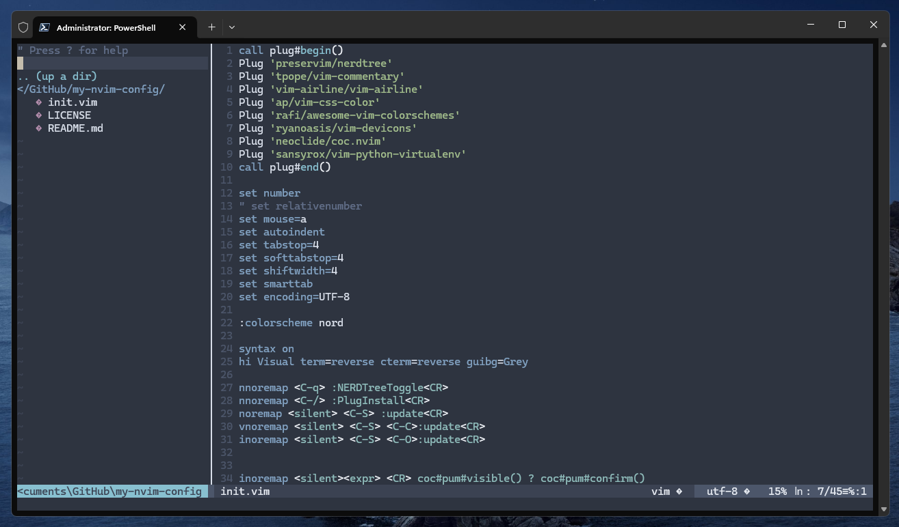

## Introduction  
This Vim configuration is tailored for efficient Python development. It includes plugins for file navigation, commenting, code completion, virtual environment management, and syntax highlighting, all integrated with `coc.nvim` for powerful language features.



## Plugins Used

- **nerdtree**: File system explorer  
- **vim-commentary**: Easy commenting/uncommenting  
- **vim-airline**: Status/tabline for Vim  
- **vim-css-color**: Displays CSS colors inline  
- **awesome-vim-colorschemes**: Collection of color schemes  
- **vim-devicons**: File icons for NERDTree and status line  
- **coc.nvim**: Intellisense engine, provides code completion, diagnostics, etc.  
- **vim-python-virtualenv**: Manage Python virtual environments inside Vim  

---

## Usage

- **Toggle NERDTree file explorer:**  
  Press `<Ctrl-q>`

- **Comment/uncomment lines:**  
  Select lines in visual mode and press `gc` (from vim-commentary)

- **Save file quickly:**  
  Press `<Ctrl-S>` in normal, visual, or insert mode

- **Python virtual environment management:**  
  Use `vim-python-virtualenv` commands to activate/deactivate virtualenvs within Vim.  
  Make sure to activate your Python virtualenv before starting Vim or use commands from the plugin.

- **Code completion and language features:**  
  `coc.nvim` provides intelligent completion, diagnostics, and more for Python via `coc-pyright`.  
  When typing Python code, suggestions will automatically appear.

-  **Window navigation**:
    - Move between splits with:
      - `<Alt-Left>` — move to left window
      - `<Alt-Down>` — move to window below
      - `<Alt-Up>` — move to window above
      - `<Alt-Right>` — move to right window

    - Tab management:
      - `<Ctrl-n>` — open new tab
      - `<Ctrl-Right>` — go to next tab
      - `<Ctrl-Left>` — go to previous tab

---

## Notes

- Make sure your Python virtual environment is activated or correctly configured in `coc.nvim` to get accurate completions and linting.
- For best results, configure your Python interpreter path inside Coc settings (`:CocConfig`) if necessary.
- The provided key mappings include:
  - `<Ctrl-q>` to toggle NERDTree
  - `<Ctrl-S>` to save
  - `<Ctrl-/>` to trigger `:PlugInstall`

---


## Troubleshooting

- If `coc-pyright` fails to install with a network error, try installing it via terminal:  
  ```bash
  npm install -g coc-pyright
  ```
- Restart Vim with `:CocRestart` after any plugin or extension installation.
- Verify that Node.js and npm are installed and working:  
  ```bash
  node -v
  npm -v
  ```

